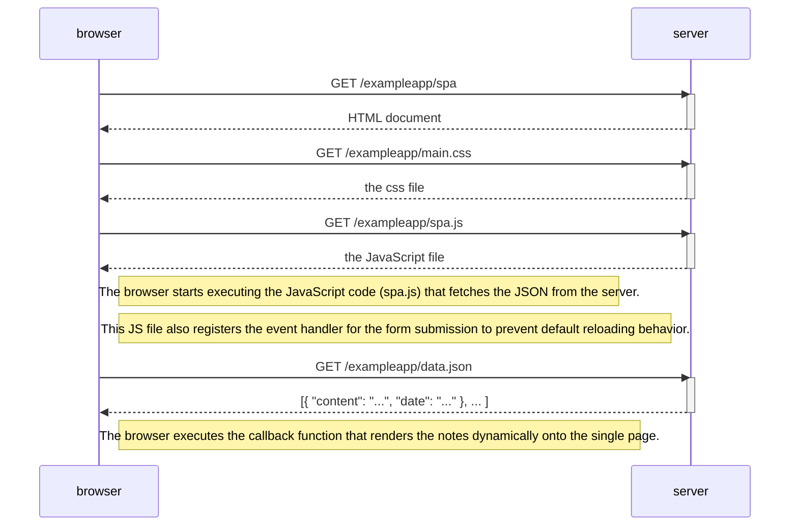

```mermaid
sequenceDiagram
    participant browser
    participant server

    browser->>server: GET /exampleapp/spa
    activate server
    server-->>browser: HTML document
    deactivate server

    browser->>server: GET /exampleapp/main.css
    activate server
    server-->>browser: the css file
    deactivate server

    browser->>server: GET /exampleapp/spa.js
    activate server
    server-->>browser: the JavaScript file
    deactivate server

    Note right of browser: The browser starts executing the JavaScript code (spa.js) that fetches the JSON from the server.
    Note right of browser: This JS file also registers the event handler for the form submission to prevent default reloading behavior.

    browser->>server: GET /exampleapp/data.json
    activate server
    server-->>browser: [{ "content": "...", "date": "..." }, ... ]
    deactivate server

    Note right of browser: The browser executes the callback function that renders the notes dynamically onto the single page.
```
