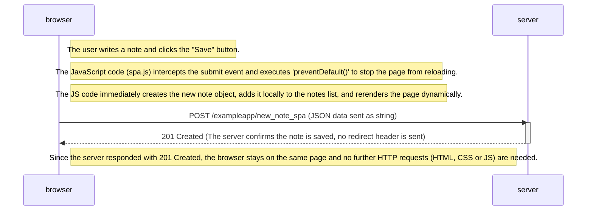

```mermaid
sequenceDiagram
    participant browser
    participant server

    Note right of browser: The user writes a note and clicks the "Save" button.
    Note right of browser: The JavaScript code (spa.js) intercepts the submit event and executes 'preventDefault()' to stop the page from reloading.
    Note right of browser: The JS code immediately creates the new note object, adds it locally to the notes list, and rerenders the page dynamically.

    browser->>server: POST /exampleapp/new_note_spa (JSON data sent as string)
    activate server
    server-->>browser: 201 Created (The server confirms the note is saved, no redirect header is sent)
    deactivate server

    Note right of browser: Since the server responded with 201 Created, the browser stays on the same page and no further HTTP requests (HTML, CSS or JS) are needed.
```
